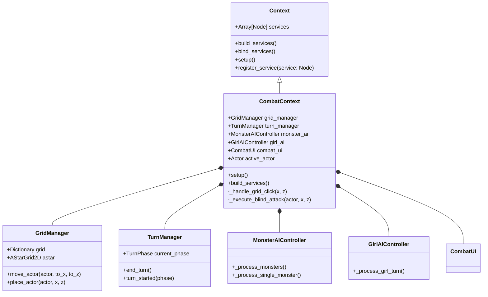
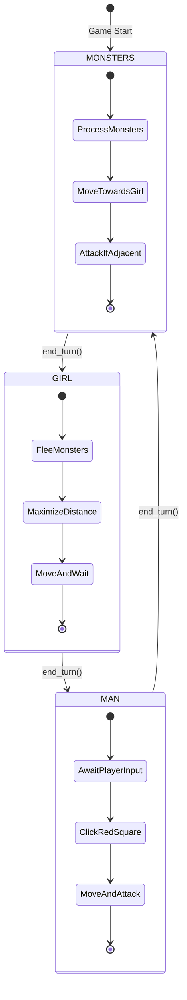
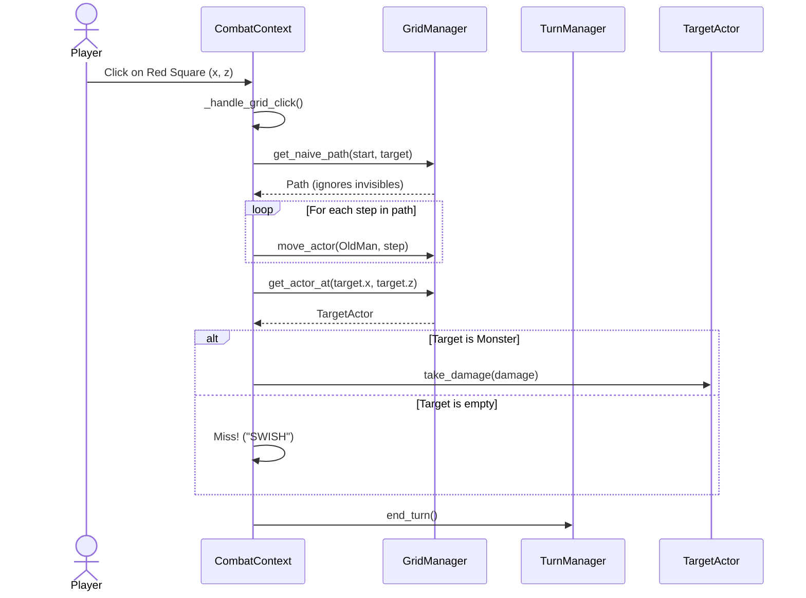

# Invisible Monster Chess Game

An isometric 3D turn-based game where the player controls two characters:
- **The Old Man**: A capable fighter who is blind to the monsters.
- **The Little Girl**: A vulnerable character who can see the invisible monsters.

The monsters are invisible to the man but visible to the girl. The player must use the girl's turn to spot the monsters and the man's turn to engage them based on memory, as the monsters will disappear during his turn. Monsters will preferentially hunt the little girl.

Turn Order: Monsters -> Girl -> Man.

## Core Design Pillars

To ensure that the codebase remains robust as new coders join the project, all code MUST adhere to the following core pillars:

1. **Readable**: Code should explain itself. Use clear, descriptive variable and method names. Provide comments and docstrings (`##`) for classes and public methods.
2. **Testable**: Systems should be decoupled to allow for easy unit testing.
3. **Understandable**: The flow of logic should be easy to follow. Avoid deep nesting or overly clever "magic" code.
4. **Maintainable**: The codebase should be structured logically so that fixing bugs does not introduce new ones.
5. **Scalable**: Adding new characters, abilities, or enemy types should not require massive rewrites of core systems.
6. **Extensible**: The architecture must support future feature additions seamlessly. 

*(Compromises to these pillars should only be made for explicitly necessary performance optimizations or security constraints).*

## Architecture Overview

This project uses **Composition over Inheritance** for its file structure and architecture. We use a **Context** and **Dependency Injection** pattern to manage game state and systems.

Please read the [ARCHITECTURE.md](ARCHITECTURE.md) for a detailed breakdown of how to build and integrate features in this project.

## Project Structure

- `context/`: Contains the global and state-specific Contexts (e.g., `GlobalContext`, `CombatContext`) and their base definitions.
- `actors/`: Characters, monsters, and entities.
- `camera/`: Contains the custom 3D isometric Gimbal Camera.
- `scenes/`: General game scenes, UI, and level layouts.

## Setup Instructions

1. Clone the repository.
2. Open the project in Godot 4.x.
3. Ensure the project settings are correctly configured for a 3D isometric view.
4. Read through `ARCHITECTURE.md` before creating new nodes or scripts.

## UML Diagrams

### Architecture & Service Injection
The game uses a composition-based architecture where `CombatContext` manages all the distinct gameplay services.

### Turn Cycle State Machine
The core loop cycles between the three main phases.

### Combat Sequence Flow
An example sequence of how the Old Man's blind attack is executed by the system.

